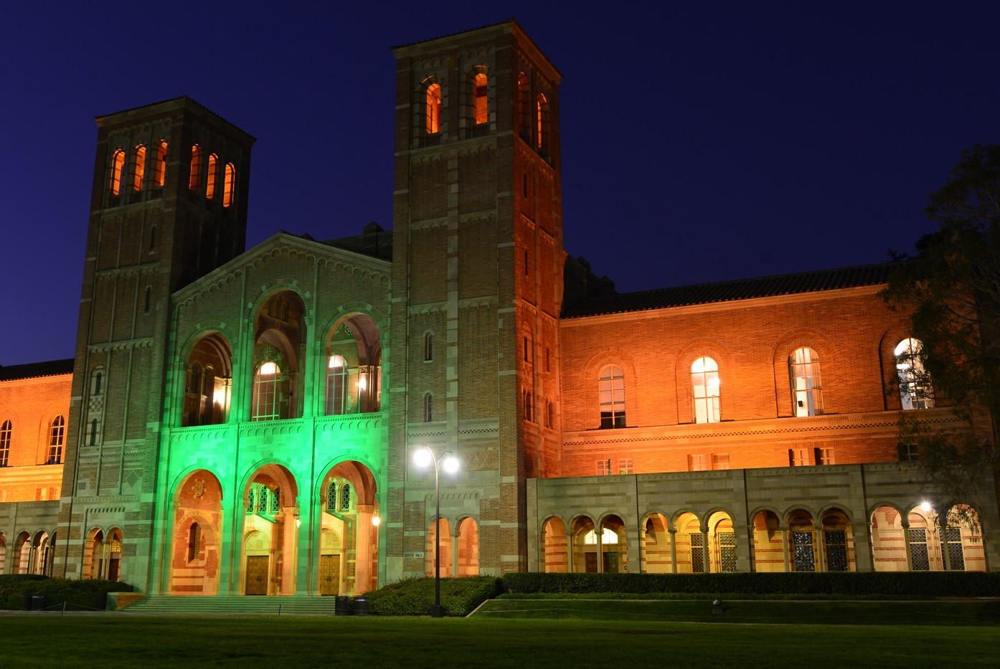

# **Thomas White**

# Welcome! I decided to make a simple website that showcases some of my work. See the about page to learn more about me, or the projects page to view a few of my most recent data science projects.
 

### Info/Links:

Phone: (585) 469-6025  
email: twhite99@g.ucla.edu  
[Github](https://github.com/twhite99)  
[LinkedIn](www.linkedin.com/in/twhite99)  
[Facebook](https://www.facebook.com/tommy.white.10888)  

<a href = "https://crumplab.github.io">

  

</a>

